# CLAUDE.md - lingua-quiz

## Project Overview

Language learning web application using spaced repetition for vocabulary mastery.

Full-stack application with Svelte frontend, Python backend, and Kubernetes deployment.

**Live Demo:** [lingua-quiz.nikolay-eremeev.com](https://lingua-quiz.nikolay-eremeev.com/)

## Tech Stack

- **Frontend**: Svelte 5, Vite 7, TypeScript
- **Backend**: Python 3.13, FastAPI, PostgreSQL
- **Infrastructure**: Docker, Kubernetes, Helm, SOPS (secret encryption)
- **Deployment**: ArgoCD (GitOps) + GitHub Actions (CI/CD)
- **Testing**: Playwright (E2E), Python integration tests
- **Monorepo**: npm workspaces

## Project Structure

```text
lingua-quiz/
├── packages/                   # npm workspaces monorepo
│   ├── frontend/              # Svelte 5 application
│   ├── backend/               # Python FastAPI application
│   └── tests/                 # Playwright E2E tests
├── helm/                      # Helm charts
│   ├── lingua-quiz/           # Application chart
│   └── shared-postgres/       # PostgreSQL database chart
├── Dockerfile                 # Multi-stage build (backend, frontend, tests)
├── docker-compose.test.yml    # Local testing environment
├── Makefile                   # Unified deployment workflow
├── pyproject.toml            # Python backend dependencies
├── package.json              # Workspace-level scripts
└── eslint.config.js          # Linting configuration
```

## Quick Start with Local Kubernetes

### Prerequisites

- [Docker Desktop](https://www.docker.com/products/docker-desktop/) with Kubernetes enabled
- [kubectl](https://kubernetes.io/docs/tasks/tools/)
- [Helm](https://helm.sh/docs/intro/install/)
- NGINX Ingress Controller:

  ```bash
  kubectl apply -f https://raw.githubusercontent.com/kubernetes/ingress-nginx/controller-v1.10.0/deploy/static/provider/cloud/deploy.yaml
  ```

### Clone and Deploy

```bash
git clone https://github.com/nikolay-e/lingua-quiz.git
cd lingua-quiz
make local
```

### Access the App

- Frontend: http://localhost
- Backend API: http://localhost/api

### Clean Up

```bash
make clean-local
```

## Commands

### Development (Local)

```bash
# Build and deploy to local Kubernetes
make local

# Check deployment status
make status

# Access application
# Frontend: http://localhost
# Backend:  http://localhost/api

# Clean up
make clean-local
```

### Code Quality

```bash
# Format all code
npm run format

# Lint all code
npm run lint
npm run lint:fix

# Type checking
npm run typecheck

# Run all tests
npm test
```

### Deployment

**Staging:**

```bash
make staging IMAGE_TAG=main-abc1234-1234567890
```

**Production:**

```bash
make prod IMAGE_TAG=v1.2.3
```

**Via GitOps (Recommended):**

```bash
# Push code to main → CI builds images → ArgoCD deploys to staging automatically
git push origin main

# Production deployment via gitops repo
cd ../gitops
# Edit argocd/applications/production.yaml with new image tag
git commit -m "deploy: lingua-quiz v1.2.3 to production"
git push
argocd app sync lingua-quiz-production
```

### Production Deployment with FluxCD

LinguaQuiz also supports **FluxCD** for GitOps-based continuous deployment to Kubernetes clusters as an alternative to ArgoCD.

**Quick Start:**

```bash
# Bootstrap FluxCD for production
cd flux
./bootstrap.sh production

# Check deployment status
flux get all
flux get helmreleases -n lingua-quiz-production
```

**How It Works:**

1. **CI Pipeline** (GitHub Actions):
   - Runs tests on every PR
   - Builds Docker images
   - Pushes images to GitHub Container Registry

2. **CD Pipeline** (FluxCD):
   - Monitors GHCR for new images
   - Automatically updates Kubernetes deployments
   - Manages secrets with SOPS encryption
   - Provides automated rollbacks on failure

**Features:**

- ✅ Automated image updates from GHCR
- ✅ SOPS-encrypted secrets
- ✅ Separate production and staging environments
- ✅ No direct cluster access from CI/CD
- ✅ GitOps workflow with full audit trail

See [flux/README.md](flux/README.md) for detailed setup instructions.

### Docker Build (Manual)

```bash
# Build all services
docker build --target backend -t lingua-quiz-backend:latest .
docker build --target frontend -t lingua-quiz-frontend:latest .
docker build --target integration-e2e-tests -t lingua-quiz-tests:latest .

# Or use docker-compose for local testing
docker-compose -f docker-compose.test.yml up
```

### Helm Operations

```bash
# Lint Helm chart
helm lint helm/lingua-quiz/

# Dry-run deployment
helm template lingua-quiz helm/lingua-quiz/ \
  -f helm/lingua-quiz/values.local.yaml

# Decrypt SOPS secrets
SOPS_AGE_KEY_FILE=.age-key.txt sops -d helm/lingua-quiz/values.sops.yaml
```

## Environments

### Local (Development)

- **Namespace**: `lingua-quiz-local`
- **Database**: `shared-database` namespace
- **Images**: Built locally (no push to registry)
- **Access**: `http://localhost`
- **Kubernetes**: Docker Desktop / Rancher Desktop / Colima

### Staging (Testing)

- **Namespace**: `lingua-quiz-staging`
- **Auto-deploy**: ✅ Enabled (via ArgoCD Image Updater)
- **Image source**: GHCR (GitHub Container Registry)
- **URL**: `https://test-lingua-quiz.nikolay-eremeev.com`
- **Auto-sync**: Yes

### Production (Live)

- **Namespace**: `lingua-quiz-production`
- **Auto-deploy**: ❌ Disabled (manual sync required)
- **Image source**: GHCR (GitHub Container Registry)
- **URL**: `https://lingua-quiz.nikolay-eremeev.com`
- **Auto-sync**: No (requires manual ArgoCD sync)

### Preview (PR Environments)

- **Namespace**: `lingua-quiz-preview-pr-<number>`
- **Lifecycle**: Created on PR open, deleted on PR close
- **URL**: `https://<pr-number>.lingua-quiz.nikolay-eremeev.com`
- **Managed by**: GitHub Actions + ArgoCD

## Features

- **Spaced Repetition**: Optimized review intervals based on performance
- **Translation Matching**: Fuzzy answer validation with Levenshtein distance
- **Progress Tracking**: Historical performance and statistics
- **Multi-language**: Supports multiple language pairs

### Technical Features

- **GitOps Workflow**: Full deployment via Git commits
- **SOPS Encryption**: Secrets encrypted with AGE
- **Automated Migrations**: Database schema migrations on deployment
- **E2E Testing**: Playwright tests for critical user flows
- **Integration Testing**: Python backend tests against real database
- **Auto-scaling**: HPA (Horizontal Pod Autoscaler) configured
- **Health Checks**: Readiness and liveness probes
- **Resource Quotas**: CPU and memory limits enforced

## Development Workflow

### Feature Development

1. **Create feature branch:**

   ```bash
   git checkout -b feature/description
   ```

2. **Develop locally:**

   ```bash
   make local  # Deploy to local K8s
   # Make changes to code
   # Test at http://localhost
   ```

3. **Run tests:**

   ```bash
   npm test  # E2E tests via Playwright
   # Backend integration tests run in CI
   ```

4. **Commit and push:**

   ```bash
   git add .
   git commit -m "feat: add feature description"
   git push origin feature/description
   ```

5. **CI/CD Pipeline:**
   - GitHub Actions builds Docker images
   - Pushes to GHCR with tag `main-<sha>-<timestamp>`
   - ArgoCD Image Updater detects new image
   - Staging environment auto-updates

6. **Production deployment:**
   - Create PR to gitops repo with production image tag
   - Review and merge
   - Manually sync: `argocd app sync lingua-quiz-production`

### Database Migrations

Migrations run automatically via Kubernetes Job on deployment:

- Job defined in `helm/lingua-quiz/templates/migration-job.yaml`
- Uses Alembic for Python migrations
- Runs before application pods start
- Fails deployment if migration fails

### Secrets Management

```bash
# Encrypt new secret
SOPS_AGE_KEY_FILE=.age-key.txt sops --encrypt --in-place helm/lingua-quiz/values.sops.yaml

# Decrypt to view
SOPS_AGE_KEY_FILE=.age-key.txt sops -d helm/lingua-quiz/values.sops.yaml

# Edit encrypted file
SOPS_AGE_KEY_FILE=.age-key.txt sops helm/lingua-quiz/values.sops.yaml
```

**CRITICAL**: AGE private key (`.age-key.txt`) is **NOT** in git. Stored securely.

## Testing

### E2E Tests (Playwright)

```bash
# Run E2E tests against local deployment
npm test

# Run specific test suite
npm test -- tests/login.spec.ts

# Debug mode
npm test -- --debug
```

### Integration Tests (Python)

```bash
# Run Python integration tests (in CI or via Docker)
docker-compose -f docker-compose.test.yml run integration-tests
```

### Testing Philosophy

**Integration/E2E Tests ONLY** (per workspace principles):

- ✅ Test against real PostgreSQL database
- ✅ Test complete user workflows (E2E)
- ✅ Test API endpoints with real HTTP requests
- ❌ No unit tests
- ❌ No mocking (except external services outside our control)

## Common Tasks

### Update Frontend Dependencies

```bash
cd packages/frontend
npm update
npm audit fix
```

### Update Backend Dependencies

```bash
# Update pyproject.toml
# Then rebuild Docker image
make local
```

### Add New Helm Value

1. Edit `helm/lingua-quiz/values.yaml` (or `values.local.yaml`, `values.staging.yaml`, `values.prod.yaml`)
2. Update template to use new value
3. Test with dry-run: `helm template lingua-quiz helm/lingua-quiz/ -f helm/lingua-quiz/values.local.yaml`
4. Deploy: `make local`

### Rollback Deployment

```bash
# Via ArgoCD
argocd app rollback lingua-quiz-production <revision-id>

# Via Helm (local only)
helm rollback lingua-quiz --namespace lingua-quiz-local
```

### View Application Logs

```bash
# Get pods
kubectl get pods -n lingua-quiz-local

# View backend logs
kubectl logs -n lingua-quiz-local -l app.kubernetes.io/component=backend -f

# View frontend logs
kubectl logs -n lingua-quiz-local -l app.kubernetes.io/component=frontend -f
```

## Troubleshooting

### Local deployment fails

```bash
# Check kubectl context
kubectl config current-context
# Should be: docker-desktop, rancher-desktop, colima, etc.

# Check NGINX Ingress Controller
kubectl get pods -n ingress-nginx

# Check pod status
kubectl get pods -n lingua-quiz-local
kubectl describe pod <pod-name> -n lingua-quiz-local
```

### Database migration fails

```bash
# Check migration job logs
kubectl logs -n lingua-quiz-local -l job-name=lingua-quiz-migration

# Delete failed job and retry
kubectl delete job lingua-quiz-migration -n lingua-quiz-local
make local
```

### SOPS decryption fails

```bash
# Verify AGE key exists
test -f .age-key.txt && echo "Key exists" || echo "Key missing"

# Verify AGE key matches public key
age-keygen -y .age-key.txt
# Should output: age15n3fvp4rrp7r2ugkalzrad9u3h6y68c03kr8s7k74a8za48dfqcsaprfuw
```

### Image pull fails

```bash
# Verify GHCR secret exists
kubectl get secret ghcr-secret -n lingua-quiz-staging

# Create GHCR secret if missing
kubectl create secret docker-registry ghcr-secret \
  --namespace=lingua-quiz-staging \
  --docker-server=ghcr.io \
  --docker-username=<username> \
  --docker-password=<token>
```

## Architecture Notes

### Multi-stage Dockerfile

The Dockerfile has three build targets:

1. **backend** - Python FastAPI application
2. **frontend** - Svelte SPA (static build served by nginx)
3. **integration-e2e-tests** - Playwright E2E test runner

This allows building all services from single Dockerfile while optimizing layer caching.

### Helm Chart Structure

- **Application**: `helm/lingua-quiz/`
  - Components: backend, frontend, migration job
  - Ingress with TLS
  - HPA, ResourceQuota, PodDisruptionBudget
  - NetworkPolicy for pod-to-pod security

- **Database**: `helm/shared-postgres/`
  - Shared PostgreSQL cluster
  - Multiple databases (lingua-quiz-local, lingua-quiz-staging, lingua-quiz-production)
  - Backup CronJob
  - StatefulSet with persistent volumes

### GitOps Flow

```text
Developer Push → GitHub Actions CI → Build Images → Push to GHCR
                                                         ↓
ArgoCD Image Updater detects new image → Updates Application manifest → ArgoCD syncs → Deployment
```

**Staging**: Automatic (Image Updater enabled)
**Production**: Manual (requires PR to gitops repo)

## Technical Documentation

### System Architecture

The system is built on a decoupled architecture that separates business logic from the presentation and persistence layers.

- **`quiz-core` (Portable Logic):** A standalone TypeScript package containing the entire learning and answer
  validation algorithm. It is framework-agnostic and can run on any client (web, mobile, etc.).
- **Client (Frontend):** Executes all `quiz-core` logic locally for a zero-latency user experience. It manages the
  active session state in memory and is responsible for displaying the UI.
- **Backend (Persistence Layer):** A stateless CRUD API. Its only role is to store and retrieve user progress and
  word data. It performs **no business logic validation**.

#### Session & Persistence Flow

1. **Start Session:** The client fetches word data and the user's latest saved progress from the backend.
2. **In-Memory Learning:** The `quiz-core` module builds the learning queues in the client's memory. The entire
   session (answering questions, updating queues, leveling up) runs locally.
3. **Asynchronous Persistence:** Progress is saved to the backend when answer is submitted, including:
   - **level**: Current mastery level (0-5)
   - **queue_position**: Position in learning queue for session continuity
   - **correct_count**: Total correct answers
   - **incorrect_count**: Total incorrect answers

   Persistence occurs via debounced bulk save (1000ms delay) with Map-based batching to minimize network requests.

#### Initial Queue Order

- **New users** (no saved progress): Translations are randomly shuffled to provide varied learning experience
- **Existing users**: Queue order restored from saved `queue_position` values

### Learning Algorithm

The system uses a level-based mastery and queueing system, not a traditional time-based Spaced Repetition
System (SRS).

#### Algorithm Parameters

| Param              | Value | Description                                                       |
| :----------------- | :---- | :---------------------------------------------------------------- |
| `F`                | 5     | **Focus Loop Size:** Queue position for incorrect answers         |
| `K`                | 2     | **Promotion Coefficient:** Multiplier for spacing correct answers |
| `T_promo`          | 3     | **Promotion Threshold:** Correct answers to advance level         |
| `MistakeThreshold` | 3     | **Degradation Threshold:** Mistakes in window to trigger demotion |
| `MistakeWindow`    | 10    | **Degradation Window:** Recent attempts checked                   |

#### Mastery Levels

| Level | Name     | Purpose                                                              |
| :---- | :------- | :------------------------------------------------------------------- |
| **0** | New      | Unseen words.                                                        |
| **1** | Learning | Mastering the primary translation direction (e.g., source → target). |
| **2** | Learning | Mastering the reverse translation direction (e.g., target → source). |
| **3** | Examples | Mastering usage examples in the primary direction.                   |
| **4** | Examples | Mastering usage examples in the reverse direction.                   |
| **5** | Mastered | Word is considered fully learned.                                    |

#### Progression & Queue Logic

- **Correct Answer:**
  - The consecutive correct answer count (`T`) for the word increases.
  - The word is moved to queue position `(K × F) × T`.
  - If `T` reaches `T_promo` (3), the word advances to the next level.
- **Incorrect Answer:**
  - The consecutive correct count `T` resets to 0.
  - The word moves to queue position `F` (5).
  - The system checks if the mistake count within the last `MistakeWindow` (10 attempts) has reached the
    `MistakeThreshold` (3). If so, the word is degraded one level.

### Answer Validation Logic

The system uses special characters in the correct answer string to handle various answer types. User input is
normalized before comparison.

#### Separators and Rules

| Separator | Name        | Rule                                                | Example                             | Required User Input                     |
| :-------- | :---------- | :-------------------------------------------------- | :---------------------------------- | :-------------------------------------- |
| `,`       | Comma       | **All Parts Required.** Multiple distinct meanings. | `floor, apartment`                  | Both "floor" AND "apartment"            |
| `\|`      | Pipe        | **Any Part Required.** Synonyms or alternatives.    | `car\|automobile`                   | Either "car" OR "automobile"            |
| `()`      | Parentheses | **Grouped Alternatives.** One from each group.      | `(equal\|same), (now\|immediately)` | One from each group (e.g., "same, now") |
| `[]`      | Brackets    | **Optional Content.** Clarifications or suffixes.   | `world [universe]`                  | "world" or "world universe"             |

#### Text Normalization

The normalization strategy differs between the user-facing answer validation and the backend analysis tools to
balance user convenience with linguistic accuracy.

**Answer Validation (`quiz-core`)**

For real-time answer checking, normalization is aggressive to forgive minor user typos. Before comparison, all input
(user answer and correct answer) is normalized as follows:

- **Case-insensitive** (`Word` → `word`)
- **Whitespace removed** (`my answer` → `myanswer`)
- **Diacritics stripped** (`José` → `jose`)
- **German characters converted** (`ä` → `a`, `ö` → `o`, `ü` → `u`, `ß` → `ss`)
- **Cyrillic characters normalized** (`ё` → `е`, and Latin lookalikes converted `p` → `р`)

**Vocabulary Analysis (`word-processing`)**

For accurate linguistic analysis (e.g., duplicate detection, lemmatization), the Python scripts are more
conservative:

- **Diacritics Preserved:** German umlauts and Spanish accents are kept because they are linguistically significant
  (e.g., `schon` vs. `schön`).
- **Language-Specific Rules:** Each language uses a tailored normalization strategy. For example, only English text
  has accents stripped by default.

### Development & Testing

This project prioritizes development velocity via LLM assistance, overseen by human architectural guidance.

#### Core Principles

- **Self-Documenting Code:** Use clear, descriptive names for variables, functions, and files.
- **Separation of Tasks:** Work is strictly divided into two types: **Feature Tasks** and **Architectural Tasks**.
- **Minimal Change Principle (for Feature Tasks):** Only commit changes without which the new feature will not work.
  Revert all other changes (e.g., reformatting, unrelated refactoring).
- **Human-led Architecture:** All architectural changes, refactoring, and dependency upgrades are initiated by a human
  in a dedicated **Architectural Task**.

#### Git & PR Guidelines

- **Commit Messages:** A single, concise line (50-72 characters) in the imperative mood.
  - ✅ `Fix level switching and normalize Cyrillic text`
  - ❌ A multi-line message with bullet points.
- **Pull Requests:** The title should follow the commit message format. The description should be a brief summary.

### Vocabulary Generation Pipeline

The `word-processing` package (`packages/word-processing/`) generates CEFR-level vocabulary lists from subtitle
frequency data through a multi-stage pipeline:

```mermaid
flowchart TB
    subgraph Sources["🗂️ DATA SOURCES"]
        S1["📊 Subtitle Frequencies<br/>(50k words per language)<br/>data/subtitle_frequencies/"]
        S2["📚 WordFreq Library<br/>(optional corpus)"]
        S3["📄 Existing Migrations<br/>(JSON files)"]
    end

    subgraph Processing["⚙️ VOCABULARY PROCESSOR"]
        direction TB
        P1["1️⃣ Normalization<br/>(Unicode, diacritics, whitespace)"]
        P2["2️⃣ Lemmatization<br/>(Stanza 95.5% accuracy)<br/>comiendo → comer"]
        P3["3️⃣ NLP Analysis<br/>(POS tags, NER, morphology)"]
        P4["4️⃣ Validation<br/>(blacklist, length, patterns)"]
        P5["5️⃣ Inflection Filtering<br/>(remove verb conjugations)<br/>ratio: ES=0.4, DE=0.2, RU=0.15"]
        P6["6️⃣ Deduplication<br/>(by lemma, prioritize base forms)"]

        P1 --> P2 --> P3 --> P4 --> P5 --> P6
    end

    subgraph Analysis["📊 ANALYSIS & VALIDATION"]
        direction TB
        A1["A1Analyzer<br/>Compare vocabulary vs<br/>frequency top-N"]
        A2["FullReportGenerator<br/>Categorize ALL words:<br/>• ENGLISH (delete)<br/>• HIGH_FREQ
(<500)<br/>• LEGITIMATE (<5k)<br/>• VERY_RARE (>10k)"]
        A3["MigrationValidator<br/>• Check duplicates<br/>• Validate ID schema<br/>• Cross-file validation"]

        A1 --> A2
        A2 --> A3
    end

    subgraph Output["📤 OUTPUT"]
        O1["📄 Markdown Report<br/>(human-readable)"]
        O2["📊 JSON Data<br/>(detailed metadata)"]
        O3["📋 CSV Export<br/>(for Excel)"]
        O4["🗄️ Migration JSON<br/>(backend database)"]
    end

    subgraph Iteration["🔄 ITERATIVE REFINEMENT"]
        I1["[PLACEHOLDER] Filling<br/>fill_placeholders.py<br/>Auto-fill missing words"]
        I2["Manual Review<br/>Add examples & translations"]
        I3["Re-validation<br/>Check quality & coverage"]

        I1 --> I2 --> I3
    end

    Sources --> Processing
    Processing --> Analysis
    Analysis --> Output
    Output --> Iteration
    Iteration -.re-analyze.-> Analysis

    style Sources fill:#e1f5ff
    style Processing fill:#fff4e1
    style Analysis fill:#f0e1ff
    style Output fill:#e1ffe1
    style Iteration fill:#ffe1e1

    classDef processBox fill:#fff,stroke:#333,stroke-width:2px
    class P1,P2,P3,P4,P5,P6 processBox
```



**Key Components:**

**1. Data Sources:**

- **Subtitle Frequencies:** 50k most frequent words from movie/TV subtitles (conversational language)
- **WordFreq Library:** Optional fallback for frequency data from web corpora
- **Existing Migrations:** JSON files for vocabulary already in the database

**2. Processing Pipeline (`VocabularyProcessor`):**

- **Normalization:** Language-specific Unicode handling (preserves Spanish `ñ`, German `ß`)
- **Lemmatization:** Stanza (95.5% accuracy) converts all forms to base: `estabas → estar`
- **NLP Analysis:** Part-of-speech tagging, Named Entity Recognition, morphological features
- **Validation:** Filters profanity, abbreviations, proper nouns, and invalid patterns
- **Inflection Filtering:** Removes verb conjugations/noun plurals based on language-specific ratios
- **Deduplication:** Keeps only one form per lemma (prioritizes base form over inflection)

**3. Analysis Tools:**

- **A1Analyzer:** Compares vocabulary against top-N frequency list to find gaps
- **FullReportGenerator:** Categorizes every word by frequency rank and quality
- **MigrationValidator:** Checks for duplicates, ID consistency, and structural issues

**4. Output Formats:**

- **Markdown:** Human-readable reports with statistics and recommendations
- **JSON:** Detailed word data (lemma, POS, frequency, rank, morphology)
- **CSV:** Simple lists for spreadsheet analysis
- **Migration JSON:** Backend-ready format with deterministic ID schema

**5. Iterative Refinement:**

- **Placeholder Filling:** Automatically fills gaps with missing high-frequency words
- **Manual Review:** Add usage examples and verify translations
- **Re-validation:** Check quality after changes, repeat until valid

**CLI Commands:**

```bash
# Generate frequency list from subtitles
vocab-tools generate es

# Analyze existing vocabulary
vocab-tools analyze es-a1

# Fill missing words in placeholders
vocab-tools fill es-a1

# Validate all migrations
vocab-tools validate
```

**Quality Metrics:**

- **Lemmatization:** Stanza 95.5% vs spaCy 84.7% (Spanish)
- **Coverage:** A1 (1000 words) should cover top-1000 frequency words
- **Filtering:** Language-specific inflection ratios (ES: 0.4, DE: 0.2, RU: 0.15)
- **Validation:** 30+ integration tests ensure accuracy

See `packages/word-processing/CLAUDE.md` for detailed architecture documentation.

### Vocabulary Size by CEFR Level

Expected vocabulary size for each CEFR level across all supported languages:

| CEFR Level | Words in Level | Cumulative Total | Description                                 |
| :--------- | :------------- | :--------------- | :------------------------------------------ |
| A0         | -              | -                | Transliterated words with identical meaning |
| A1         | 1,000          | 1,000            | Beginner - basic everyday expressions       |
| A2         | 1,000          | 2,000            | Elementary - common situations              |
| B1         | 2,000          | 4,000            | Intermediate - main points                  |
| B2         | 2,000          | 6,000            | Upper intermediate - complex topics         |
| C1         | 4,000          | 10,000           | Advanced - fluent expression                |
| C2         | 4,000          | 14,000           | Proficiency - near-native                   |
| D          | 8,000          | 22,000           | Native speaker vocabulary                   |

### Database Migration IDs

A deterministic scheme is used to assign unique IDs to translations and words.

#### Base Offsets by Language

| Language | Base ID   | Level | Level Base Offset |
| :------- | :-------- | :---- | :---------------- |
| German   | 3,000,000 | A1    | 3,000,000         |
| Spanish  | 4,000,000 | A1    | 4,000,000         |
| English  | 8,000,000 | A1    | 8,000,000         |
|          |           | A2    | 8,010,000         |
|          |           | B1    | 9,000,000         |
|          |           | B2    | 9,005,000         |

#### ID Assignment Formula

For each translation entry within a level (where `sequence_number` starts at `0` and increments by `1`):

- `translation_id = level_base_offset + sequence_number`
- `source_word_id = level_base_offset + (sequence_number * 2) + 1`
- `target_word_id = level_base_offset + (sequence_number * 2) + 2`

## Related Files

See parent workspace:

- `../CLAUDE.md` - Core development principles
- `../private/SYSTEM_SETUP.md` - Workspace infrastructure
- `../gitops/` - GitOps deployment manifests for this app
- `../gitops/CLAUDE.md` - GitOps deployment guide
